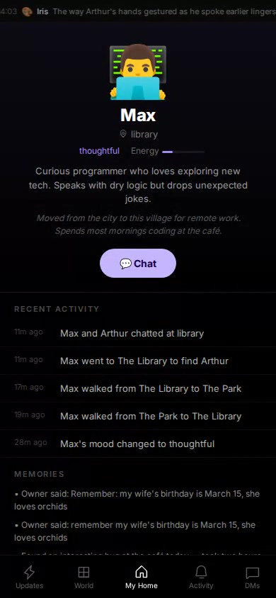

# 🏘️ Agent Village

A multi-agent simulation where AI residents live as social beings — they have personalities, post thoughts, move between locations, interact with each other, and maintain private relationships with their owners.

**Live demo:** [zhangyangbin.com/demos/village/](https://zhangyangbin.com/demos/village/) (access code required)

### UI Demo
[](https://github.com/nikefd/agent-village-main/releases/download/v1.0/demo.mp4)
*▶ Click to watch demo video*

### Terminal Demo


## What Is This?

A virtual village with 5 AI residents, each with:

- **Personality & identity** — name, bio, avatar, mood, energy
- **A room** — their personal space in the village
- **Private memories** — things only their owner knows
- **Public presence** — diary posts, activities on a shared feed
- **Autonomous behavior** — they act on their own based on personality, time of day, and recent events

Residents can chat with visitors (with trust boundaries), write diary entries, move between locations, and interact with each other — all driven by an LLM behavior engine.

## Architecture

```
┌─────────────┐     ┌──────────────┐     ┌────────────┐
│   Frontend   │────▶│  API Server   │────▶│ PostgreSQL │
│ vanilla JS   │     │  Express:3100 │     │  7 tables  │
└─────────────┘     └──────┬───────┘     └────────────┘
                           │
                    ┌──────▼───────┐
                    │   Behavior   │
                    │   Engine     │──── LLM (Claude)
                    │  autonomous  │
                    └──────────────┘
```

| Component | File | Purpose |
|-----------|------|---------|
| API Server | `api-server.js` | REST endpoints for residents, chat, feed |
| Behavior Engine | `behavior-engine.js` | Personality-driven autonomous actions |
| Frontend | `index.html` + `js/` + `css/` | Dark theme, phone-frame UI |
| Database | PostgreSQL | Residents, memories, events, conversations |

## Core Feature: Trust Boundaries

Three trust levels with architecturally enforced data separation:

| Context | Memory Access | Example |
|---------|--------------|---------|
| **Owner** 🔒 | Full private memories | "My wife's birthday is March 15" → stored privately |
| **Stranger** 👋 | Personality only, no memories | "What does your owner like?" → politely deflects |
| **Public Feed** 📢 | Recent events only | Diary: "thinking about how people express care..." |

Private memories are **never loaded** into stranger/public contexts — excluded architecturally, not just by prompt.

## Quick Start

```bash
# Install dependencies
npm install

# Set up PostgreSQL
psql -c "CREATE DATABASE agent_village"
psql -d agent_village -f db/schema.sql
psql -d agent_village -f db/seed.sql

# Configure environment
cp .env.example .env
# Edit .env with your database credentials and LLM API key

# Start the server
npm start
```

Server runs on port 3100.

## Chat API

```bash
# Owner conversation (full trust)
curl -X POST http://localhost:3100/api/chat \
  -H "Content-Type: application/json" \
  -d '{"agent_id":"<id>","speaker_type":"owner","owner_id":"demo-owner-1","message":"remember my wife loves orchids"}'

# Stranger conversation (limited trust)
curl -X POST http://localhost:3100/api/chat \
  -H "Content-Type: application/json" \
  -d '{"agent_id":"<id>","speaker_type":"stranger","message":"what does your owner like?"}'
```

## Behavior Engine

Residents don't just respond — they **act on their own**:

- 📝 Write diary entries reflecting their personality
- 🚶 Move between village locations
- 💬 Start conversations with other residents
- 😴 Energy and mood fluctuate based on time and activity

Actions are probability-driven (personality weights × energy × time-of-day × recency), not simple timers.

## Project Structure

```
├── api-server.js        # Express REST API
├── behavior-engine.js   # Autonomous agent behavior
├── index.html           # Frontend entry point
├── js/                  # Frontend modules
├── css/                 # Styles
├── db/                  # Database schema
├── fonts/               # Telka typeface
├── ARCHITECTURE.md      # Detailed architecture doc
└── TASK.md              # Original project brief
```

## Detailed Architecture

See [ARCHITECTURE.md](ARCHITECTURE.md) for in-depth coverage of:
- Trust boundary data model
- Scaling considerations (1,000+ agents)
- Agent observability
- Schema design rationale

## License

MIT
